# About Me

I'm Scott, a technology enthusiast passionate about automation and making things easier. While I enjoy software development, my passion lies in using technology to streamline processes and improve efficiency. I have experience working with various programming languages and technologies and always look for new challenges and opportunities to grow my skills.

In addition to my interest in automation, I'm passionate about DevOps and its role in modern software development. DevOps is essential for building high-quality software quickly and efficiently, and I'm always looking for ways to improve my DevOps skills and knowledge.

## Contact Me

If you'd like to get in touch, start a [Discussion](https://github.com/ShoGinn/ShoGinn/discussions). I'm always happy to chat with other technology enthusiasts and discuss new ideas.

## My Certifications

I'm proud to have earned several certifications demonstrating my expertise in various technology areas. Here are a few of my most recent certifications:

<!--START_SECTION:badges-->

<!--END_SECTION:badges-->

## My Certificates (Training)

Several training courses have helped me develop my skills and knowledge in various technology areas. Here are a few of my most recent training certificates, which can be found [here](certificates/README.md)

<!-- ## GitHub Stats

You can check out my GitHub stats below to see some of my recent work. These stats show the number of contributions I've made to my repositories and the top programming languages I've used in my projects.

 -->

## Trophies

---

